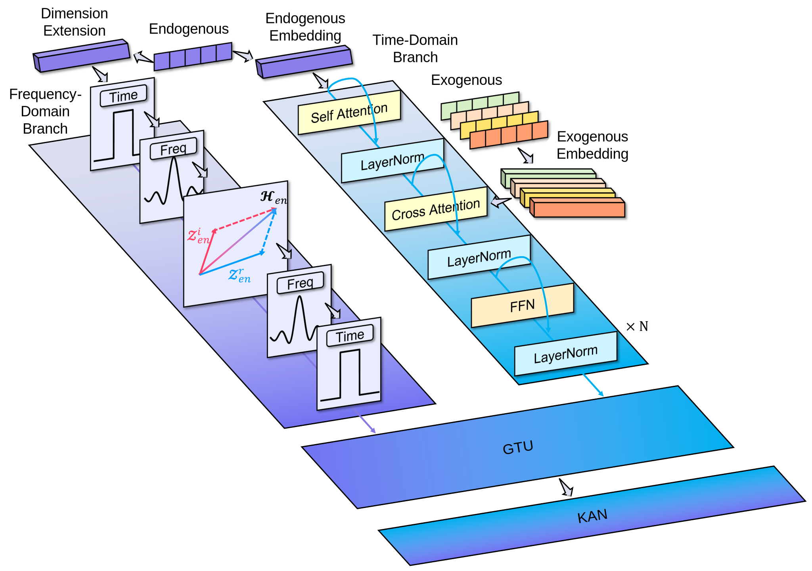
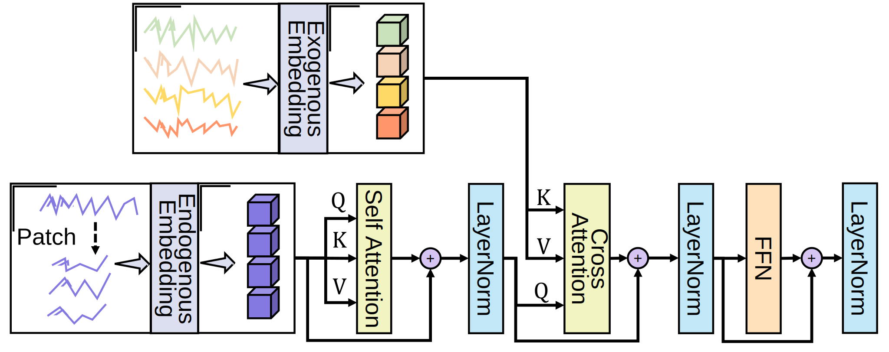
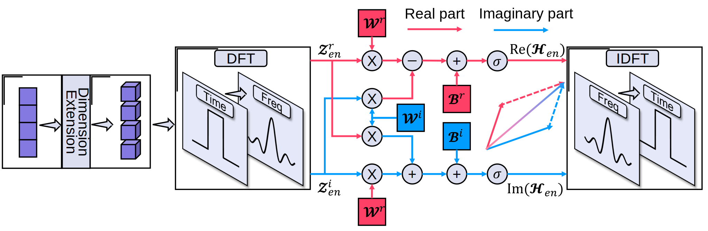
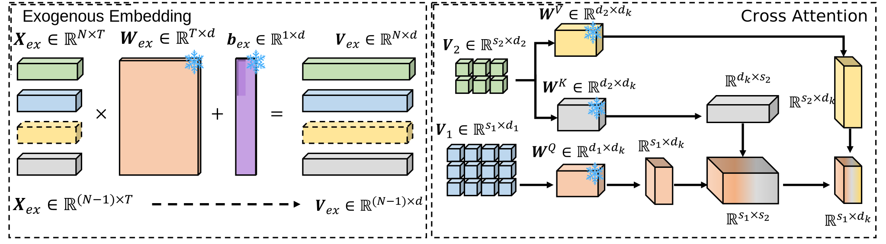
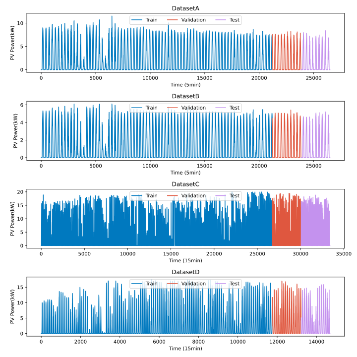
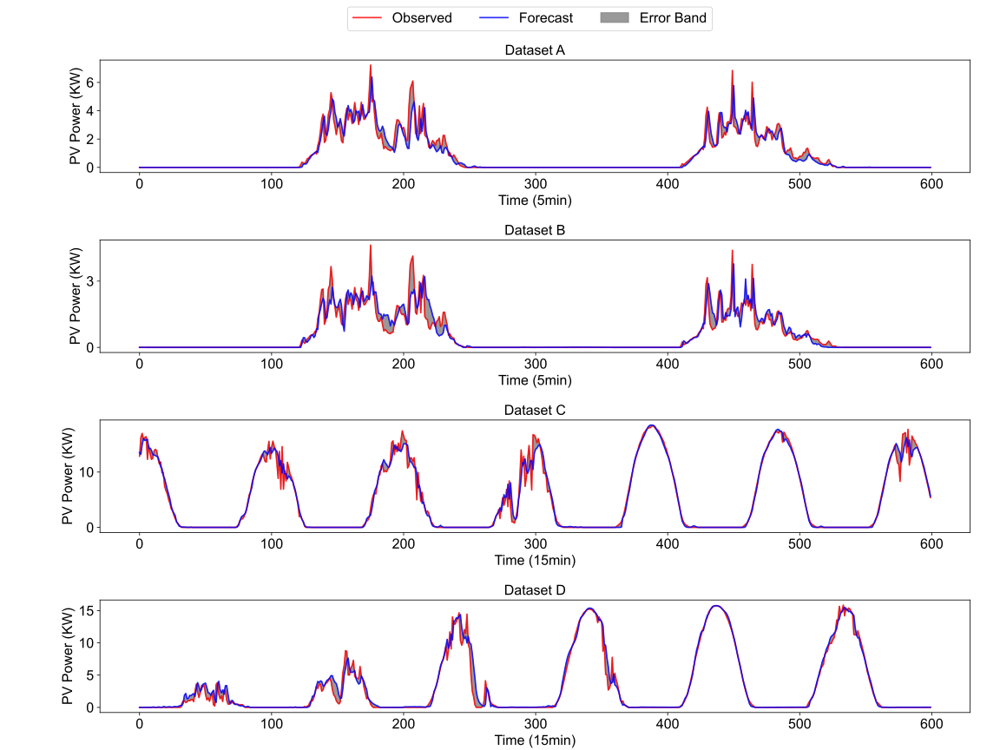
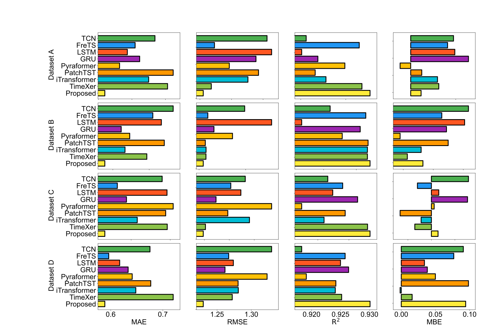

# :memo: Abstract
Rising global energy demand and the surging computational load of the AI era have intensified requirements for reliable and flexible power systems. As a key renewable energy source, solar photovoltaic (PV) generation presents distinct forecasting challenges, primarily owing to the necessity of effectively modeling temporal dependencies and accounting for external influences. However, most existing methods encode endogenous and exogenous variables in a unified manner, overlooking their inherent differences, and seldom integrate **time-domain** and **frequency-domain** features in a cohesive framework. This paper proposes a novel time–frequency collaborative forecasting model that separately encodes endogenous and exogenous variables to better capture their distinct dynamics. **The model segments endogenous sequences for temporal modeling and embeds exogenous variables as independent tokens to enhance robustness against input dropout**. Simultaneously, a discrete Fourier transform is applied to endogenous sequences, and the extracted spectral features are integrated into the temporal representation through a gated mechanism. Finally, a Kolmogorov–Arnold Network (KAN) maps the fused features to the forecast horizon. Experimental results on PV datasets demonstrate the model’s superior forecasting accuracy compared to existing baselines.
# :rocket: Model Structure
**Model Structure** is shown as 
  

**time-domain structure** is shown as 
  

**frequency-domain structure** is shown as 
  

The proposed model encodes exogenous variables independently at the variable level and fuses them with endogenous features via cross-attention. **Because the encoding and attention parameters do not depend on the number of exogenous inputs, the trained network can directly accept any subset of external variables without modification or retraining**. The mechanism is as 
  

# :chart_with_upwards_trend: Date Source 
Dataset A & B: Collected from Sites 1B and 24 of the [Desert Knowledge Solar Centre  (Australia)](https://dkasolarcentre.com.au/) at 5-minute intervals between 00:00 UTC on 1 March 2021 and 00:00 UTC on 1 June 2021. Missing entries (162 at Site 1B; 9 at Site 24) were imputed using the monthly mean, resulting in 26496 complete records per site.
Dataset C & D: Sourced from the publicly released [POVD repository (Sites 01 and 03)](http://www.dx.doi.org/10.11922/sciencedb.01094/)via the Science Data Bank , with 15-minute resolution. Dataset C spans 16:00 on 30 June 2018 to 15:45 on 13 June 2019 (33 408 points); Dataset D covers 16:00 on 11 January 2019 to 15:45 on 13 June 2019 (14 688 points). Both contain no missing data. 
  

 
 | Dataset | Resolution | Time Span | Length | Max | Min | Mean | Variance |
| --- | --- | --- | --- | --- | --- | --- | --- |
| A | 5min | 2021/3/1~2020/6/1 | 26496 | 11.52 | 0 | 2.28 | 3.08 |
| B |  |  |  | 6.11 | 0 | 1.39 | 1.9 |
| C | 15min | 2018/6/30~2019/6/13 | 33408 | 20 | 0 | 3.68 | 5.55 |
| D |  | 2019/1/11~2019/6/13 |  | 17.42 | 0 | 3.37 | 4.97 |
|  |  |  |  |  |  |  |  |

# :white_check_mark: Results 
The forecasts of proposed model is as  
  
,
  

